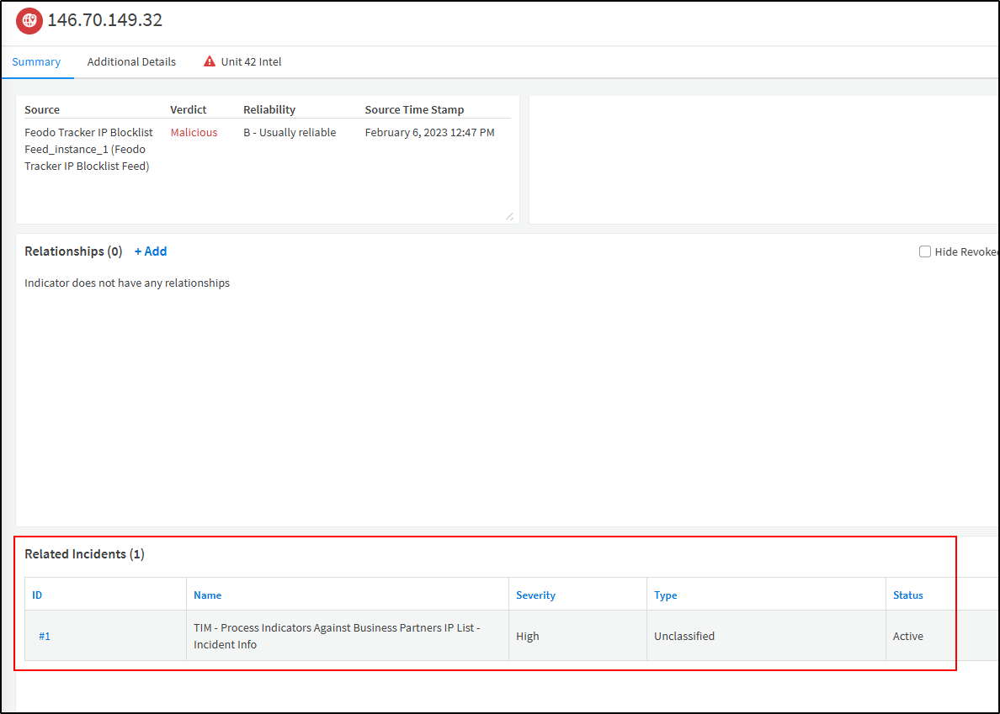

<h1 align="center">📡 Threat Intelligence Automation with Cortex XSOAR</h1>

  A hands-on exploration of automating threat detection, indicator mapping, and response orchestration using Palo Alto Cortex XSOAR.

<h2>🧾 Summary</h2>

  In this project, I worked within the Cortex XSOAR platform to manage and enrich threat intelligence data, automate incident response workflows, and generate actionable reports. By leveraging XSOAR's CLI, war room, and playbooks (to automate incident response and handling), I simulated a real-world SOC operation—from the detection of a malicious indicator to its investigation, remediation, and reporting. In thisexercise I learned the powerful automation & orchestration capabilities of Cortex XSOAR in reducing response time and human error.

<h2>⚙️ ThreatOps Workflow</h2>

<ul>
  <li>
    🔠Reviewed real-time dashboards and threat intel feeds to search for malicious indicators. 
   
  </li>

  <li>
    📌 Mapped a suspicious indicator to an active phishing incident via the XSOAR CLI interface. 
    
  </li>

  <li>
    🧠 Verified the indicator was linked successfully using the war room and matched it with an incident ID (<code>Incident ID: 1</code>). 
    
  </li>

  <li>
    🤖 Confirmed the automated playbook execution triggered upon incident creation. 
    
  </li>

  <li>
    🔄 Generated an External Dynamic List (EDL) using the <em>Generic Export Indicators</em> service integration with the following settings:
    <ul>
      <li>Port: <code>8443</code></li>
      <li>Refresh Interval: <code>5 minutes</code></li>
      <li>Maximum List Size: <code>2500</code></li>
      <li>Format: <code>text</code></li>
    </ul>
        
  </li>

  <li>
    📄 Designed a custom threat intelligence report template for use in automated responses. 
    
  </li>

  <li>
    🧭 Walked through the auto-generated work plan to review each playbook task. 
  </li>

  <li>
    ✅ Within the playbook:
    <ul>
      <li>Selected to continue blocking the indicator (<code>Yes</code>)</li>
      <li>Set the URL for the block list to the previously created EDL</li>
    </ul>
    
  </li>

  <li>
    📑 Playbook automation finalized by generating the customized threat intel report and closing the incident ticket. 
     
  </li>
</ul>

